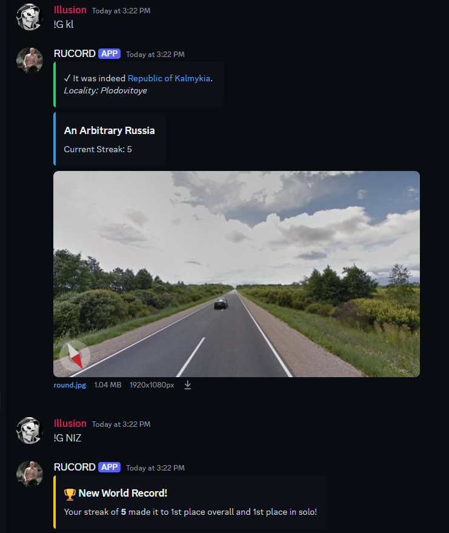

# GeoGuessr Streakbot
A Discord bot for playing GeoGuessr streaks with friends. Players are shown Street View images and must guess the correct subdivision to maintain their streak. Countries can also be added with a bit of extra work.


The bot includes:
* Solo and assisted streaks
* Accuracy tracking and statistics
* Personal and global leaderboards
* Compass overlay
* 5Ks
* Map switching

# Getting Started
1. Clone the repository
2. Install dependencies:
```
pip install -r requirements.txt
```

3. Set up environment variables:

DISCORD_TOKEN - Your Discord bot token
NCFA - GeoGuessr authentication cookie
BIGDATACLOUD_API_KEY - API key for reverse geocoding


4. Configure allowed channels in config.py
5. Run the bot:

```
python bot.py
```

# Commands
## Game

!guess [subdivision] - Make a guess for the current round
!pic - Show the current round's picture again
!compass - Show the compass direction
!skip - Skip the current round (resets streak)
!map - Get a link to the ChatGuessr map

## Stats & Leaderboards

!stats - Show your personal statistics
!stats global - Show global statistics
!leaderboard - Show top streaks
!5k - Show your 5K statistics

## Utility

!aliases [subdivision] - Show all aliases for a given subdivision
!participants - Show all participants in the current streak
!switchmap - Switch between available maps

## Moderation

!start - Manually starts a new game (resets streak)
!fix - If something breaks, manually starts a new game (doesn't reset streak)